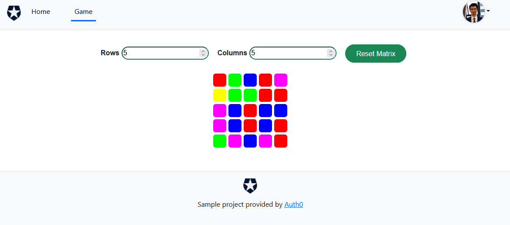

# Project description
This is a quick demo of a web application featuring a simple color matrix game with authentication provided by Auth0. 

This project's structure was generated by https://auth0.com/docs/quickstarts. 

## Project setup

```bash
npm install
```

### Compiles and hot-reloads for development

```bash
npm run serve
```
### Default server url
http://localhost:3000/

